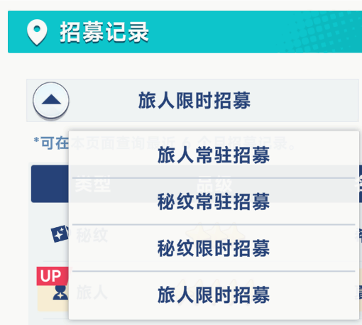

# 星塔旅人抽卡记录工具

## 软件是做什么的

这是一个面向《星塔旅人》国服 Windows 客户端的非官方抽卡记录整理工具。

软件可以读取并保存四类招募记录：

- 旅人限时招募
- 秘纹限时招募
- 旅人常驻招募
- 秘纹常驻招募

界面会统计总抽数、五星数量、当前垫抽和五星间隔。限时卡池会按具体卡池展示官方名称、活动时间、实际抽数，以及五星结果的 `UP` 或 `歪`。历史记录会持续合并到本地归档，不会因为官方只保留近期记录而主动删除旧数据。

## 怎么实现的

软件通过 Windows `ReadProcessMemory`，只读访问游戏客户端当前已经加载到 Lua 运行时中的招募历史。

- 不抓包，不运行本地代理服务器。
- 不注入 DLL。
- 不修改游戏文件或游戏内存。
- 不模拟点击，不发送游戏协议请求。
- 每次读取时动态查找 Lua 数据，不依赖固定内存地址。

读取结果会整理为本地 JSON/CSV，并合并保存到 `exports/stellasora_gacha_archive.json`。角色与秘纹头像只用于本地界面展示。

## 使用流程

1. 启动并登录《星塔旅人》，进入游戏主界面。
2. 在游戏中依次打开四类招募记录，并等待每个记录列表显示出来。

3. 以管理员身份运行本工具，点击“刷新游戏数据”。
4. 等待读取完成，在首页和“招募记录”页面查看结果。
5. 新角色和秘纹图片会随软件版本内置更新；发现新版本时使用“检查更新”。

游戏不会在登录时一次性加载全部招募历史。未在游戏内打开的分类可能无法读取，软件会在界面中显示当前已加载的分类数量。

## 使用建议

- 每次产生新抽卡记录后，先在游戏中打开对应分类的招募记录，再刷新软件数据。
- 建议定期使用设置页面的“创建备份”，或者手动备份 `exports/stellasora_gacha_archive.json`。
- 官方记录可能只保留最近半年。本地归档可以保留更早记录，但必须在官方记录过期前至少读取并保存一次。
- 统计结果只基于当前已经读取并归档的数据。若早期记录缺失，首个五星的间隔和当前垫抽可能不完整。
- 安装版适合日常使用；便携版移动时应将整个程序目录和 `exports` 数据一起保留。

## 注意事项与风险说明

- 本项目为非官方个人研究工具，与游戏运营方、开发方不存在关联，也未获得官方认可或授权。
- “刷新游戏数据”需要管理员权限，因为软件需要只读访问游戏进程。其他浏览和备份功能不需要读取游戏进程。
- 虽然软件不注入、不修改游戏数据，但任何读取游戏进程的第三方工具都无法保证绝对没有账号或反作弊风险。请自行阅读游戏服务条款并评估风险。
- 游戏更新可能改变 Lua 数据结构、字段名称或反作弊策略，导致读取失败、数据不完整或工具暂时不可用。
- 请仅在自己的账号和设备上使用，不要将本工具用于违规、商业或破坏性用途。
- 导出的记录不包含账号密码、Cookie、SDK Token 或网络会话数据，但可能反映个人游戏行为，请谨慎分享。
- 使用者自行承担使用本工具产生的后果。因数据不完整、游戏更新、账号处置、软件不可用或第三方服务变化造成的损失，项目维护者不承担责任。
